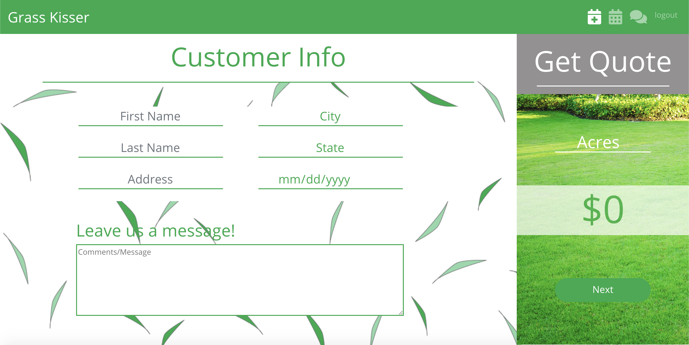
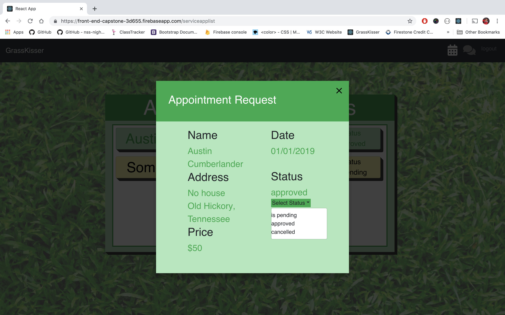

This project was bootstrapped with [Create React App](https://github.com/facebook/create-react-app).

# GrassKisser
My app will allow users to make appointments for their lawn to be cut. The user submits their name, the date they would like their grass cut, their address, and the size of their lawn. The user will instantly receive an estimate for the service. The user will also be able to add comments or messages for extra detail. This app app will be a two part system, as the service provider will be able to accept or deny the request for service, based on their availability. The service provider will also be able to comment/message the user.

### How to run this app

* Clone the project and install all dependencies using the command line:

```
npm install
```

* Rename apiKeys.js.example file to apiKeys.json
* Create a new project in Firebase and add your api keys to apiKeys.json.
* Run the server in terminal:
```
npm start
```

## Screenshots
### User Side

1. Login


2. Home


3. Make a New Appointment


4. Appointments


5. Messages


### Service Provier Side

1. Set Appointment Status


2. Set Appointment Status



